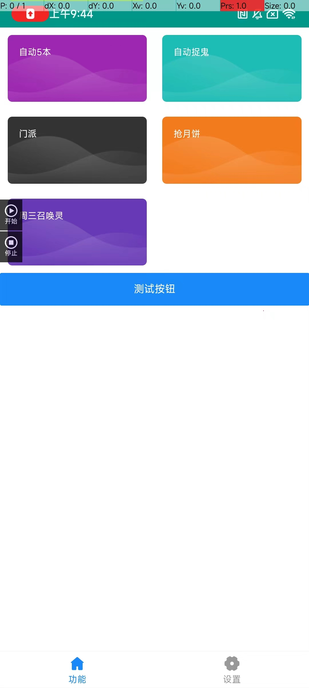

# 新建了一个交流群：
> 1. 需要关注公众号：不可思议的脚本
> 2. 回复 入群  即可获取最新的入群二维码
> 3. 回复 梦幻  可以获取最新的安装包与1年有效期的验证码(估计1年之后大家也不玩了吧)

# 保持开源心态 热爱分享

# 基于autojs开发 梦幻西游手游脚本 实现自动5本 自动抢月饼 自动抓鬼等一切可自动的任务 
> 1. 仅适用安卓平台
> 2. 仅运行在安卓7.0以上
> 3. 比较适用于个人，不适用于工作室
> 4. 不需要root 但是需要开启悬浮窗权限、无障碍权限，安装过程中会有病毒提示，强行安装即可，所有代码均开源，经的起考验
> 5. 有时间会持续更新的(2024年2月24号，希望多多关注支持，这样才有动力去更新)

# 项目运行原理
> 1. 基于autojs开发
> 2. 基本autojs文字识别gmlkit.ocr(img, "zh")，找到相关的文字并点击
> 3. 基于autojs提供的findImage(img, templ),找到根据提供的图片模板来查找图片，找到图片坐标点后并点击
> 4. 配合梦幻西游手游中固定操作实现固定的模拟点击

# 注意事项
> 1. 脚本在执行的过程中不要操作手机，否则会导致脚本执行中断与出错
> 2. 脚本是基于图片识别与文字识别的，所以一旦在执行的过程中操作会导致脚本执行出错

## 运行到手机上
> 1. 下载release版本：[v0.7.0](https://github.com/kaykie/mengHuang/releases/tag/0.7.0)（还在迭代中）
> 1. 国内码云下载：[v0.7.0](https://gitee.com/kaykie/menghuang/releases/tag/0.7.0)（还在迭代中）
> 2. 安装到安卓手机上
> 3. 打开app
> 4. 给app授予无障碍权限与悬浮窗权限
安装视频：
[梦幻西游手游脚本工具安装视频帮助](https://www.bilibili.com/video/BV14u4y1a74U/?vd_source=aaeac5472d9a7973b9dd9d80c1c42b4d)

## 项目运行

node 版本 16.14.0；
参考autojs运行方式

> 一. `npm install`
>
> 二. `npm run serve`
> 
> 三. autojs运行方式 参考autojs[文档](https://github.com/kkevsekk1/AutoX)

## 目前已实现自动化功能

所有功能的前提是在脚本app中先点击相应的任务并点击执行，然后再到梦幻西游手游中点击开始

> 1. 自动抢月饼

  使用前置：需要手动调整到购买页面，应用脚本判断当前是否有月饼，如果有则会购买，如果没有则会点击 中秋月饼 这4个字 再点击中秋月饼刷新列表

  视频：
  > [梦幻西游手游自动抢月饼脚本，无需root，项目已开源至github](https://www.bilibili.com/video/BV1kN411t7Wd/)

> 2. 自动无限鬼
  
  使用前置：需要领取捉鬼任务,再点击开始，脚本会识别捉鬼任务并点击，在捉完一轮后会自动进行下一轮

> 3. 自动三本、五本
   使用前置：需要位于长安城，脚本流程 点击左上角长安城=>点击百晓仙子 => 点击选择副本 => 点击进入 => 副本固定流程 => 副本结束 => 重回长安城 => 再次点左上角击长安城 =>...
  自动五本，需要手动点击确认后，重新回到长安城，才可以触发执行

> 4. 自动门派
  首次需要点击任务领取
  然后点击执行脚本即可
  [周一自动门派视频](https://www.bilibili.com/video/BV19w411X7Vx/)

> 5. 周三自动召唤灵
  使用前置：点击领取任务，并进入副本，然后再点击开始按钮即可。 脚本会不断去循环是否在战斗中，如果在不在战斗中，则找相关的文字，然后点击进入战斗，一直到9点40分，停止执行脚本
  视频：
  [周三自动召唤灵](https://www.bilibili.com/video/BV1CG41117oX/)
> 6. 自动抢铅功能
  使用前置：需要手动调整到购买铅列表页面，代码会判断是列表是否有铅，如果没有则，点击采矿，回到上一页，再点击铅刷新列表
  视频：[自动抢铅功能]( https://b23.tv/I3uduzA)

## 未来
`打包apk 以供下载` --- 已实现

`跟随版本更新脚本内容`

`实现侠士自动` -- 已实现

`自动抢货`

`样式优化`

`日常活动自动化`

`通过百度提供的pd ocr识别工具定制化开发梦幻西游手游的文字识别`

`添加执行任务过程中出错判断`
## 截图

 
 

## 框架中用到的开源项目
脚手架工具：https://github.com/msdog/vue-autojs @msdog

