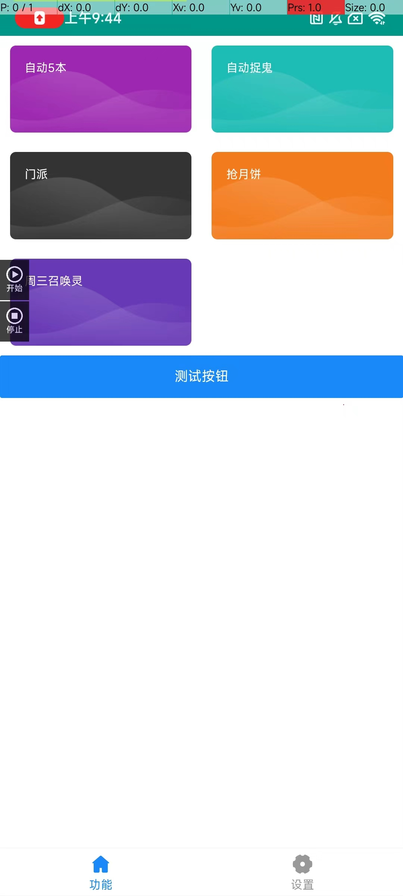
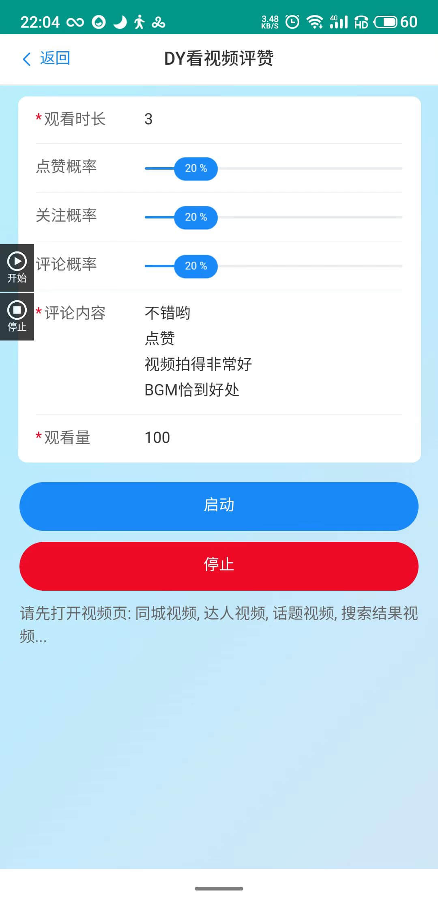
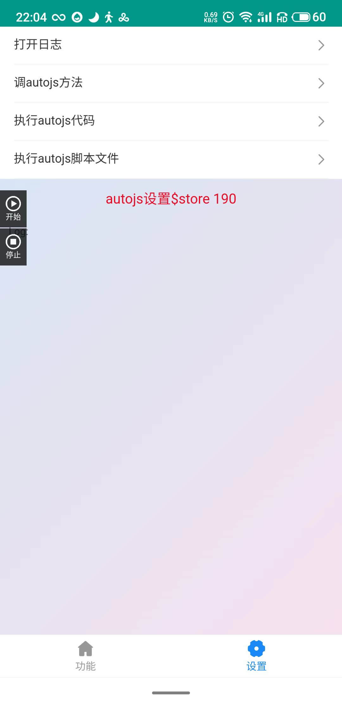

# VUE & AUTOJS ( 像开发Vue前端一样开发autoJS ! )
## 前端人0分钟上手! 
## 用Vue控制手机上的APP!
## 真正做到实时热更新脚本!!!


> 使用 `vue3 vue_cli vant` 作为 autojs 的界面，可以互相通讯。
>
> 当然也可以用 react(Vue3真香) 之类的前端框架

## 适用范围
 auto.js 都能用 (包括 autoX 等等)

## 使用(前端Vue人直接上手)
一. `npm install`，

二. `npm run serve`，


三.在 VSCode 中 打开根目录 `autoWebview.js` 修改 `initUi('http://192.168.31.201:5666/#/')` vue cli 运行的局域网地址

四.按下核弹按钮 `F5` BOOM
## 灵感来源

这一套逻辑的灵感来源于 [autojs_web 项目](https://github.com/xxxxue/autojs_web)
和 [robot 项目](https://github.com/yooge/robot)

代码热更新

## 未来

`jio本加密`


## 截图





## 联系方式

## QQ : 451652176

## QQ群 : 314707476 (进来就是沙发)

# 支持作者

如果这个开源项目 可以帮助到你, 你也可以请作者吃一包辣条。


```src
src                       
├─ assets                 
│  ├─ img                 
│  │  └─ gray-float.png   
│  └─ style               
│     ├─ global.styl      
│     ├─ reset.styl       
│     └─ var.styl         
├─ auto                   jio本文件夹
│  ├─ global              jio本全局方法
│  │  ├─ robot.global.js  
│  │  └─ robot.menu.js    
│  ├─ robot               jio本文件
│  │  ├─ robot.douyin.js  
│  │  └─ robot.weixin.js  
│  ├─ JSSDK.js            jio本SDK入口 window.auto 方法在此
│  └─ tsconfig.json       代码提示
├─ views                  Vue 不解释
│  ├─ Douyin.vue          
│  ├─ Home.vue            
│  ├─ TabRouteView.vue    
│  ├─ User.vue             window.auto 使用方式
│  └─ Weixin.vue          
├─ App.vue                
├─ flexable.js            
├─ main.js                
├─ router.js              
└─ store.js               

```
---
